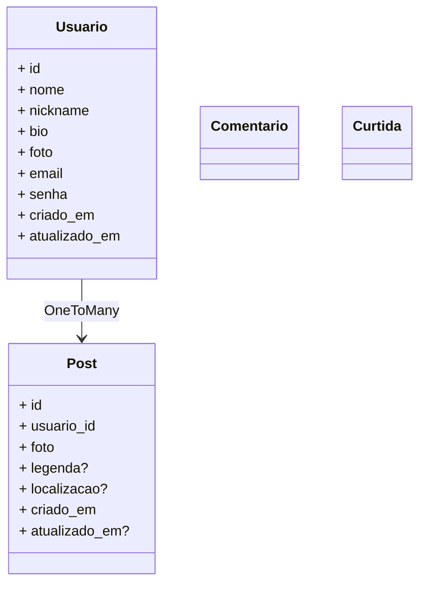

#API do Instagram

## Tecnologias
-NodeJS
-ExpressJS
-MYSQL

### Recursos
-Usuarios
-Post
-Comentarios
-Curtidas

### Estrutura do dados

```mermaid
classDiagram
    Usuario --> Post: OneToMany

    class Usuario{
        + id
        + nome
        + nickname
        + bio
        + foto
        + email
        + senha
        + criado_em
        + atualizado_em
    }

    class Post {
        + id
        + usuario_id
        + foto
        + legenda?
        + localizacao?
        + criado_em
        + atualizado_em?
    }

    class Comentario{

    }

    class Curtida{

    }
```
